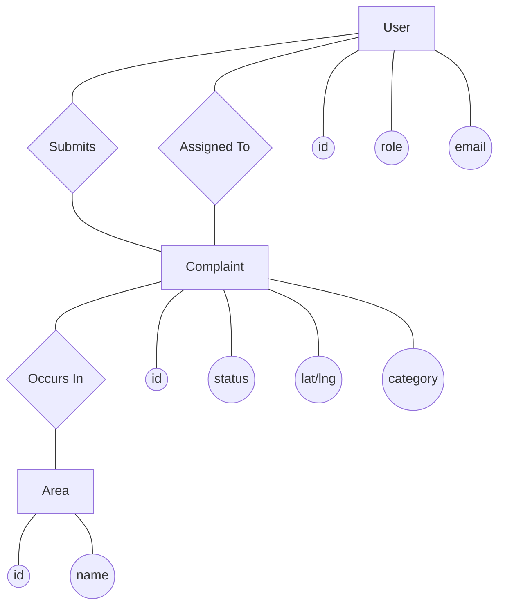

# CityWatch — Entity Relationship Diagram (ERD)

> **Generated from live source analysis** — Java entities, repositories, services, and application.properties.  
> **Database:** PostgreSQL via Supabase (`ddl-auto=update`, tables created/managed by Hibernate JPA).  
> **Mermaid ERD version:** Copy the block below and paste in [mermaid.live](https://mermaid.live) or any Mermaid renderer.

---

## 1. Mermaid ERD — Clean Copy-Paste Code

```mermaid
erDiagram

    %% ─────────────────────────────────────────────
    %%  CORE TABLES (12 total physical tables)
    %% ─────────────────────────────────────────────

    areas {
        BIGSERIAL   id              PK
        VARCHAR100  name            UK "unique area name"
        VARCHAR100  city
        DOUBLE      boundary_lat_min
        DOUBLE      boundary_lat_max
        DOUBLE      boundary_lng_min
        DOUBLE      boundary_lng_max
        DOUBLE      center_lat      "NOT NULL"
        DOUBLE      center_lng      "NOT NULL"
        TIMESTAMP   created_at
    }

    users {
        VARCHAR12   id              PK
        VARCHAR50   username        UK  "NOT NULL"
        VARCHAR100  email           UK  "NOT NULL"
        VARCHAR255  password_hash       "BCrypt hashed"
        VARCHAR15   phone           UK
        VARCHAR20   role                "CITIZEN | COORDINATOR | ADMIN"
        VARCHAR20   trust_level         "NORMAL | UNDER_REVIEW | RESTRICTED"
        VARCHAR20   status              "ACTIVE | WARNING | SUSPENDED"
        INTEGER     strike_count        "default 0"
        BIGINT      area_id         FK  "nullable — coordinators only"
        VARCHAR100  city                "NOT NULL"
        VARCHAR2    state_code
        VARCHAR2    rto_code
        TIMESTAMP   created_at
        TIMESTAMP   updated_at
    }

    complaints {
        VARCHAR17   id                      PK
        VARCHAR12   citizen_id              FK  "NOT NULL"
        BIGINT      area_id                 FK  "NOT NULL"
        VARCHAR30   category                    "POTHOLE|GARBAGE|STREETLIGHT|DRAINAGE|OTHER"
        TEXT        description                 "NOT NULL"
        DOUBLE      latitude                    "NOT NULL — GPS"
        DOUBLE      longitude                   "NOT NULL — GPS"
        VARCHAR30   status                      "11-state lifecycle"
        DOUBLE      intensity_score             "log-weighted score"
        VARCHAR10   priority                    "LOW|MEDIUM|HIGH|CRITICAL"
        VARCHAR12   assigned_coordinator_id FK  "nullable"
        TIMESTAMP   sla_deadline                "nullable — set at assignment"
        INTEGER     escalation_level            "default 0"
        INTEGER     reopen_count                "default 0"
        TIMESTAMP   created_at
        TIMESTAMP   updated_at
        TIMESTAMP   closed_at                   "nullable"
    }

    complaint_images {
        VARCHAR17   complaint_id    FK  "NOT NULL — parent"
        VARCHAR500  image_url           "NOT NULL"
    }

    complaint_upvotes {
        VARCHAR17   complaint_id    FK  "NOT NULL — parent"
        VARCHAR12   citizen_id          "citizen who upvoted"
    }

    votes {
        VARCHAR17   id              PK
        VARCHAR17   complaint_id    FK  "NOT NULL"
        VARCHAR12   coordinator_id  FK  "NOT NULL"
        VARCHAR20   decision            "VALID|INVALID|NEEDS_CLARIFICATION"
        TEXT        comment             "nullable"
        TIMESTAMP   voted_at
    }

    proofs {
        VARCHAR17   id                      PK
        VARCHAR17   complaint_id            FK  "NOT NULL"
        VARCHAR12   coordinator_id          FK  "NOT NULL"
        VARCHAR500  image_url                   "NOT NULL — live photo"
        DOUBLE      latitude                    "NOT NULL — GPS at proof time"
        DOUBLE      longitude                   "NOT NULL"
        DOUBLE      distance_from_complaint      "calculated"
        BOOLEAN     is_location_valid            "within ~1km"
        TIMESTAMP   submitted_at
    }

    comments {
        VARCHAR17   id              PK
        VARCHAR17   complaint_id    FK  "NOT NULL"
        VARCHAR12   user_id         FK  "NOT NULL"
        TEXT        content             "NOT NULL"
        VARCHAR17   parent_id       FK  "nullable — self-ref for threads"
        BOOLEAN     is_moderated        "default false"
        TIMESTAMP   created_at
    }

    escalations {
        VARCHAR17   id              PK
        VARCHAR17   complaint_id    FK  "NOT NULL"
        INTEGER     level               "1=admin notified, 2=high, 3=critical"
        VARCHAR50   reason              "SLA_EXCEEDED|CITIZEN_REJECTION|ADMIN_TRIGGER"
        TEXT        notes               "nullable"
        BOOLEAN     is_resolved         "default false"
        TIMESTAMP   triggered_at
        TIMESTAMP   resolved_at         "nullable"
    }

    notifications {
        VARCHAR17   id              PK
        VARCHAR12   user_id         FK  "NOT NULL — recipient"
        VARCHAR200  title               "NOT NULL"
        TEXT        message             "NOT NULL"
        VARCHAR30   type                "COMPLAINT_UPDATE|VOTE_REQUIRED|SLA_WARNING|ESCALATION|SYSTEM"
        VARCHAR17   reference_id        "nullable — points to complaint or escalation"
        BOOLEAN     is_read             "default false"
        TIMESTAMP   created_at
    }

    audit_logs {
        VARCHAR17   id              PK
        VARCHAR12   user_id         FK  "nullable — NULL = system action"
        VARCHAR50   action              "e.g. COMPLAINT_SUBMITTED, STATUS_CHANGED"
        VARCHAR30   entity_type         "COMPLAINT | USER | VOTE"
        VARCHAR17   entity_id           "ID of the affected row"
        TEXT        old_value           "nullable — JSON snapshot"
        TEXT        new_value           "nullable — JSON snapshot"
        VARCHAR45   ip_address          "nullable"
        TIMESTAMP   timestamp
    }

    sla_config {
        BIGSERIAL   id              PK
        VARCHAR30   category        UK  "one row per category"
        INTEGER     sla_hours           "NOT NULL — resolution window"
        VARCHAR12   created_by      FK  "nullable — admin who set it"
        TIMESTAMP   updated_at
    }

    %% ─────────────────────────────────────────────
    %%  RELATIONSHIPS
    %% ─────────────────────────────────────────────

    areas         ||--o{  users                  : "has many coordinators (area_id)"
    areas         ||--o{  complaints             : "has many complaints (area_id)"

    users         ||--o{  complaints             : "submits (citizen_id)"
    users         |o--o{  complaints             : "assigned to (assigned_coordinator_id)"
    users         ||--o{  votes                  : "casts (coordinator_id)"
    users         ||--o{  proofs                 : "submits (coordinator_id)"
    users         ||--o{  comments               : "writes (user_id)"
    users         ||--o{  notifications          : "receives (user_id)"
    users         |o--o{  audit_logs             : "actor (user_id — nullable)"
    users         |o--o{  sla_config             : "created_by (nullable)"

    complaints    ||--o{  complaint_images       : "has images (ElementCollection)"
    complaints    ||--o{  complaint_upvotes      : "has upvotes (ElementCollection)"
    complaints    ||--o{  votes                  : "has votes"
    complaints    ||--o{  proofs                 : "has proofs"
    complaints    ||--o{  comments               : "has comments"
    complaints    ||--o{  escalations            : "has escalations"

    comments      |o--o{  comments               : "parent_id (self-ref thread)"

    sla_config    }o--||  complaints             : "category drives sla_deadline"
```



---

## 2. Mermaid Chen Notation ERD (`flowchart` alternative)

*Note: Mermaid's `erDiagram` uses Crow's Foot notation by default. Below is a simulation of the classic **Chen Notation** (Rectangles = Entity, Diamonds = Relationship, Ellipses = Attributes) for the core domain.*



---

## 2. Tables Overview — What Exists in the DB

| # | Table | Type | Hibernate Source | Purpose |
|---|-------|------|-----------------|---------|
| 1 | `areas` | Core entity | `Area.java` | Geographical zones; bounding-box approach |
| 2 | `users` | Core entity | `User.java` | All actors: citizens, coordinators, admins |
| 3 | `complaints` | Core entity | `Complaint.java` | The central domain object |
| 4 | `complaint_images` | `@ElementCollection` | `Complaint.java` line 44–47 | Multi-image per complaint (flat join table) |
| 5 | `complaint_upvotes` | `@ElementCollection` | `Complaint.java` line 49–52 | Citizens who upvoted (set of IDs) |
| 6 | `votes` | Core entity | `Vote.java` | Coordinator review votes |
| 7 | `proofs` | Core entity | `Proof.java` | Photo+GPS proofs of resolution |
| 8 | `comments` | Core entity | `Comment.java` | Threaded discussion on complaints |
| 9 | `escalations` | Core entity | `Escalation.java` | Audit trail of SLA breaches |
| 10 | `notifications` | Core entity | `Notification.java` | In-app notification inbox |
| 11 | `audit_logs` | Core entity | `AuditLog.java` | Append-only operation history |
| 12 | `sla_config` | Reference/config | `SlaConfig.java` | Per-category resolution windows |

**Total physical tables created by Hibernate: 12**

---

## 3. Relationships — Full Mapping with Cardinality

### 3.1 `areas` ↔ `users`
| Property | Value |
|----------|-------|
| **Type** | Many-to-One (from users side) |
| **Cardinality** | `areas` `1` — `M` `users` |
| **FK** | `users.area_id → areas.id` |
| **Nullable?** | YES — only coordinators get an area; citizens and admins are area-free |
| **JPA** | `@ManyToOne(fetch=LAZY) @JoinColumn(name="area_id")` in `User.java` |
| **Why?** | Coordinators are responsible for a specific geographical zone. The nullable FK avoids having to create dummy areas for citizen/admin accounts. |
| **Why not M:M?** | A coordinator handles exactly one area at a time. Multi-area coordinators would require a join table and are not in scope. |

---

### 3.2 `areas` ↔ `complaints`
| Property | Value |
|----------|-------|
| **Type** | Many-to-One (from complaints side) |
| **Cardinality** | `areas` `1` — `M` `complaints` |
| **FK** | `complaints.area_id → areas.id` (NOT NULL) |
| **Nullable?** | NO — every complaint must belong to an area |
| **JPA** | `@ManyToOne(fetch=LAZY) @JoinColumn(name="area_id", nullable=false)` in `Complaint.java` |
| **Why?** | Area routing is foundational — coordinators are dispatched based on area, SLAs may be area-specific in future. |
| **Why not embedded?** | Areas are shared reference data, reused by many complaints and users. Embedding would duplicate data. |

---

### 3.3 `users` ↔ `complaints` (as citizen)
| Property | Value |
|----------|-------|
| **Type** | Many-to-One (from complaints side) |
| **Cardinality** | `users` `1` — `M` `complaints` |
| **FK** | `complaints.citizen_id → users.id` (NOT NULL) |
| **JPA** | `@ManyToOne(fetch=LAZY) @JoinColumn(name="citizen_id", nullable=false)` |
| **Why?** | One citizen can submit multiple complaints. Non-nullable because a complaint without an author is invalid — accountability is core to the system. |

---

### 3.4 `users` ↔ `complaints` (as coordinator)
| Property | Value |
|----------|-------|
| **Type** | Many-to-One (from complaints side) |
| **Cardinality** | `users` `1` — `M` `complaints` |
| **FK** | `complaints.assigned_coordinator_id → users.id` (NULLABLE) |
| **JPA** | `@ManyToOne(fetch=LAZY) @JoinColumn(name="assigned_coordinator_id")` |
| **Why nullable?** | Assignment happens after voting approval, not at submission. The column is null until `ComplaintService.assignCoordinator()` is called. |
| **Why same table (users), not separate?** | Roles are discriminated by the `role` enum. A separate `coordinators` table would duplicate profile data and add join overhead for no benefit at this scale. |

---

### 3.5 `complaints` ↔ `complaint_images` (`@ElementCollection`)
| Property | Value |
|----------|-------|
| **Type** | One-to-Many (Hibernate manages; no entity class) |
| **Cardinality** | `complaints` `1` — `M` `complaint_images` |
| **FK** | `complaint_images.complaint_id → complaints.id` |
| **JPA** | `@ElementCollection @CollectionTable(name="complaint_images")` |
| **Why ElementCollection and not a `Photo` entity?** | Images are just URLs (strings). They have no lifecycle, no queries-by-themselves, no relations of their own. `@ElementCollection` is the lightweight JPA mechanism for this — avoids creating a full entity with its own PK, repository, and service layer for simple value objects. |
| **Trade-off** | You cannot query `complaint_images` independently via Spring Data easily. If you ever need `SELECT * FROM complaint_images WHERE image_url = ?`, a proper `@Entity` is better. |

---

### 3.6 `complaints` ↔ `complaint_upvotes` (`@ElementCollection`)
| Property | Value |
|----------|-------|
| **Type** | One-to-Many (Hibernate manages) |
| **Cardinality** | `complaints` `1` — `M` `complaint_upvotes` |
| **FK** | `complaint_upvotes.complaint_id → complaints.id` |
| **JPA** | `@ElementCollection @CollectionTable(name="complaint_upvotes") Set<Long>` |
| **Why Set<Long> and not a Vote entity?** | Upvotes from citizens are binary (voted / not voted) with no metadata. Storing only the `citizen_id` as a primitive avoids a full junction entity. |
| **Problem / Design Issue** | ⚠️ `complaint_upvotes` stores raw `Long` IDs with NO foreign key constraint to `users.id`. Hibernate does NOT enforce referential integrity for primitive ElementCollections. Deleted users leave orphan IDs. Consider migrating to a proper entity if user cleanup is needed. |
| **Why not a join table with entity?** | At current scale, using a `Set<Long>` keeps the upvote check (`contains(citizen.getId())`) O(1) in memory. The trade-off is losing DB-level referential integrity. |

---

### 3.7 `complaints` ↔ `votes`
| Property | Value |
|----------|-------|
| **Type** | Many-to-One (from votes side) |
| **Cardinality** | `complaints` `1` — `M` `votes` |
| **FK** | `votes.complaint_id → complaints.id` (NOT NULL) |
| **Unique constraint** | `UNIQUE(complaint_id, coordinator_id)` — one vote per coordinator per complaint |
| **JPA** | `@ManyToOne @JoinColumn(name="complaint_id", nullable=false)` in `Vote.java` |
| **Why a separate table?** | Votes have their own fields (`decision`, `comment`, `voted_at`) and need to be counted/queried by `VoteRepository.countByComplaintAndDecision()`. They're entities in their own right. |
| **Voting logic (backend)** | `VoteService.evaluateVotes()`: ≥3 votes needed, ≥60% VALID → APPROVED. ≥60% INVALID → REJECTED + citizen strike. Tie → admin. |

---

### 3.8 `complaints` ↔ `proofs`
| Property | Value |
|----------|-------|
| **Type** | Many-to-One (from proofs side) |
| **Cardinality** | `complaints` `1` — `M` `proofs` |
| **FK** | `proofs.complaint_id → complaints.id`, `proofs.coordinator_id → users.id` |
| **Why M proofs per complaint?** | Rejected resolutions (REOPENED) can produce a new proof submission. History is preserved — each resolution attempt generates a new proof row. |
| **Geo-validation** | Backend calculates `distance_from_complaint` using Euclidean difference in degrees; `is_location_valid = true` if within ~1km. |

---

### 3.9 `complaints` ↔ `comments`
| Property | Value |
|----------|-------|
| **Type** | Many-to-One (from comments side) |
| **Cardinality** | `complaints` `1` — `M` `comments` |
| **FK** | `comments.complaint_id → complaints.id` (NOT NULL), `comments.user_id → users.id` (NOT NULL) |
| **Threaded replies** | `comments.parent_id → comments.id` (self-referential, nullable) |
| **Why self-join for threads?** | Nested replies are a natural tree structure. A single self-FK is the standard pattern (closure table or adjacency list). CityWatch uses the simplest: adjacency list (parent_id). Efficient for shallow threads (1–2 levels). |
| **Why not a separate `replies` table?** | Would duplicate the same schema; a self-join is cleaner and avoids managing two similar tables. |

---

### 3.10 `complaints` ↔ `escalations`
| Property | Value |
|----------|-------|
| **Type** | Many-to-One (from escalations side) |
| **Cardinality** | `complaints` `1` — `M` `escalations` |
| **FK** | `escalations.complaint_id → complaints.id` (NOT NULL) |
| **Why M escalations per complaint?** | A complaint can breach SLA multiple times across reopen cycles. Each escalation is a historical record. `is_resolved` tracks whether admin addressed it. |
| **Trigger** | `SlaScheduler.checkSlaDeadlines()` runs hourly (`@Scheduled(cron="0 0 * * * *")`), creates escalation rows automatically. |
| **Noteworthy** | `escalations` has NO `user_id` FK — it's system-generated, not user-triggered (except `ADMIN_TRIGGER` which currently has no separate auth path in controllers). |

---

### 3.11 `users` ↔ `notifications`
| Property | Value |
|----------|-------|
| **Type** | Many-to-One (from notifications side) |
| **Cardinality** | `users` `1` — `M` `notifications` |
| **FK** | `notifications.user_id → users.id` (NOT NULL) |
| **reference_id** | Loose pointer to a complaint/escalation — NOT a FK. This is intentional to keep notifications generic (can reference any entity type). |
| **Why not FK for reference_id?** | A proper polymorphic FK would require either a union table or separate nullable FK columns. The `type` field tells the frontend what `reference_id` points to. This is a standard "generic reference" pattern. |

---

### 3.12 `users` ↔ `audit_logs`
| Property | Value |
|----------|-------|
| **Type** | Many-to-One (from audit_logs side) |
| **Cardinality** | `users` `1` — `M` `audit_logs` |
| **FK** | `audit_logs.user_id → users.id` (NULLABLE) |
| **Why nullable?** | System-triggered events (SLA breach, auto-assignment) have no user actor. `NULL user_id` = "system action". |
| **entity_id** | Same pattern as `notifications.reference_id` — a generic ID without FK, categorized by `entity_type`. Append-only; no updates/deletes allowed. |

---

### 3.13 `sla_config` ↔ `complaints` (logical, not FK)
| Property | Value |
|----------|-------|
| **Type** | Logical relationship via shared enum value |
| **Cardinality** | `sla_config` `1` — `M` `complaints` (by matching category) |
| **How it works** | `ComplaintService.assignCoordinator()` calls `slaConfigRepository.findByCategory(complaint.getCategory())` and sets `complaint.sla_deadline = now + sla_hours`. |
| **Why no FK between sla_config and complaints?** | The link is via a category string, not an ID. Adding `sla_config_id` to complaints would create coupling — if SLA changes, old complaints would still reference old config. The current design stamps the deadline at assignment time. |

---

### 3.14 `users` ↔ `sla_config` (created_by)
| Property | Value |
|----------|-------|
| **Type** | Many-to-One |
| **Cardinality** | `users` `1` — `M` `sla_config` |
| **FK** | `sla_config.created_by → users.id` (NULLABLE) |
| **Why nullable?** | Default seed data is inserted without a user. Only manual admin edits would set this. |

---

## 4. Enum Reference

| Enum | Values | Used In |
|------|--------|---------|
| `Role` | `CITIZEN`, `COORDINATOR`, `ADMIN` | `users.role` |
| `TrustLevel` | `NORMAL`, `UNDER_REVIEW`, `RESTRICTED` | `users.trust_level` |
| `UserStatus` | `ACTIVE`, `WARNING`, `SUSPENDED` | `users.status` |
| `Category` | `POTHOLE`, `GARBAGE`, `STREETLIGHT`, `DRAINAGE`, `OTHER` | `complaints.category`, `sla_config.category` |
| `ComplaintStatus` | `DRAFT`, `PENDING_REVIEW`, `APPROVED`, `REJECTED`, `ASSIGNED`, `IN_PROGRESS`, `DELAYED`, `COMPLETED`, `CLOSED`, `REOPENED`, `ESCALATED` | `complaints.status` |
| `Priority` | `LOW`, `MEDIUM`, `HIGH`, `CRITICAL` | `complaints.priority` |
| `VoteDecision` | `VALID`, `INVALID`, `NEEDS_CLARIFICATION` | `votes.decision` |
| `EscalationReason` | `SLA_EXCEEDED`, `CITIZEN_REJECTION`, `ADMIN_TRIGGER` | `escalations.reason` |
| `NotificationType` | `COMPLAINT_UPDATE`, `VOTE_REQUIRED`, `SLA_WARNING`, `ESCALATION`, `SYSTEM` | `notifications.type` |

---

## 5. Complaint Status Lifecycle (State Machine)

```
[Citizen submits]
      ↓
  PENDING_REVIEW ──────────────────────────────────────────────→ REJECTED
      ↓ (≥60% VALID votes)                                         (≥60% INVALID votes)
   APPROVED
      ↓ (assignCoordinator)
   ASSIGNED  ←─────────────────────────────────────────────────── REOPENED
      ↓ (coordinator starts work)
  IN_PROGRESS
      ↓ (coordinator submits proof)
   COMPLETED
      ↓ (citizen confirms)         ↓ (citizen rejects)
    CLOSED                       REOPENED → ASSIGNED (re-cycle)
      
  IN_PROGRESS / ASSIGNED → DELAYED (SLA breached, hourly scheduler)
  DELAYED → ESCALATED (admin review)
```

---

## 6. Design Decisions — Why Used / Why Not

### ✅ Why Single `users` Table for All Roles
- Roles are discriminated with an enum column.
- Prevents JOIN overhead and data duplication.
- All role-specific fields (like `area_id`, `trust_level`, `strike_count`) are nullable where not applicable.
- **Alternative rejected:** Table-per-type inheritance (`Citizens`, `Coordinators`, `Admins`) — adds complexity for minimal gain at this project scale.

### ✅ Why No `refresh_tokens` Table
- JWTs are stateless with `jwt.expiration=86400000` (24h).
- No server-side token store needed.
- **Trade-off:** Cannot invalidate tokens before expiry. Acceptable for a student/mini project; a production system would need `refresh_tokens` + blacklist.

### ✅ Why `@ElementCollection` for Images and Upvotes
- Image URLs and upvoter IDs are value types, not entities.
- No separate repository, service, or DTO needed.
- **Risk:** No DB-level FK on `complaint_upvotes.citizen_id`. If a user is deleted, orphan IDs remain.

### ✅ Why `complaint_images` Instead of Supabase Storage FK
- Currently stores image URLs as strings (Supabase Storage paths or CDN URLs).
- Decoupled from the storage backend — changing from local to S3 to Supabase doesn't require schema migration.

### ✅ Why `notifications.reference_id` is NOT a FK
- Polymorphic reference pattern (points to complaint OR escalation).
- A proper `complaint_id + escalation_id` column pair would have many NULLs.
- The frontend uses `type` to decide how to navigate.

### ❌ Why NOT PostgreSQL `GEOMETRY` / PostGIS
- Simple bounding-box math (`ABS(lat - target) < delta`) is used throughout.
- PostGIS would unlock advanced spatial queries (polygon containment, radius in meters) but adds an extension dependency.
- Fine for MVP; `TODO: migrate to PostGIS` is noted in `docs/01-database-schema.md`.

### ❌ Why NOT a `sessions` or `tokens` Table
- Stateless JWT auth. See above.

### ❌ Why NOT a `categories` Table
- Categories are a fixed, closed enum (`POTHOLE`, `GARBAGE`, etc.).
- A separate table would allow dynamic categories but add admin UI complexity.
- `sla_config` is indexed by category VARCHAR — this effectively acts as the category registry.

### ❌ Why NOT Soft Delete
- No `deleted_at` or `is_deleted` columns anywhere.
- Complaints are closed (status=`CLOSED`/`REJECTED`), not deleted.
- Users are suspended (status=`SUSPENDED`), not erased.
- **Implication:** Permanent delete operations are not supported — audit logs remain intact.

---

## 7. Backend Wiring Map (Entity → Repository → Service → Controller)

| Entity | Repository | Service | Controller | Endpoints |
|--------|-----------|---------|------------|-----------|
| `User` | `UserRepository` | `AuthController` (inline) | `AuthController` | `POST /api/auth/register`, `POST /api/auth/login` |
| `Area` | `AreaRepository` | `ComplaintService` | `ComplaintController` | (used internally) |
| `Complaint` | `ComplaintRepository` | `ComplaintService` | `ComplaintController` | `POST /api/complaints`, `GET /api/complaints`, `GET /api/complaints/{id}`, `PUT /api/complaints/{id}/status`, `POST /api/complaints/{id}/upvote`, `POST /api/complaints/{id}/proof`, `POST /api/complaints/{id}/resolve` |
| `Vote` | `VoteRepository` | `VoteService` | `VoteController` | `POST /api/votes/{complaintId}`, `GET /api/votes/{complaintId}` |
| `Comment` | `CommentRepository` | `CommentService` | `CommentController` | `POST /api/comments/{complaintId}`, `GET /api/comments/{complaintId}` |
| `Notification` | `NotificationRepository` | `NotificationService` | `NotificationController` | `GET /api/notifications`, `PUT /api/notifications/{id}/read`, `PUT /api/notifications/read-all` |
| `AuditLog` | `AuditLogRepository` | `AuditService` | `AdminController` | `GET /api/admin/audit-logs` |
| `Escalation` | `EscalationRepository` | `SlaScheduler` (auto) | `AdminController` | `GET /api/admin/escalations` |
| `Proof` | `ProofRepository` | `ComplaintService` | `ComplaintController` | (via proof endpoint) |
| `SlaConfig` | `SlaConfigRepository` | `ComplaintService` | `AdminController` | `GET /api/admin/sla`, `PUT /api/admin/sla/{category}` |

---

## 8. Indexes Created by Hibernate

| Table | Index / Constraint | Column(s) | Purpose |
|-------|--------------------|-----------|---------|
| `complaints` | `idx_complaint_area` | `area_id` | Filter by zone |
| `complaints` | `idx_complaint_status` | `status` | Filter by lifecycle state |
| `complaints` | `idx_complaint_citizen` | `citizen_id` | My-complaints query |
| `votes` | `UNIQUE` | `complaint_id, coordinator_id` | One vote per coordinator |
| `sla_config` | `UNIQUE` | `category` | One SLA config per category |
| `users` | `UNIQUE` | `username`, `email`, `phone` | Identity constraints |
| `areas` | `UNIQUE` | `name` | Zone name uniqueness |

> Additional indexes defined in `docs/01-database-schema.md` SQL script (location, SLA deadline, notifications) should be applied manually in Supabase SQL editor — Hibernate `ddl-auto=update` does NOT create custom indexes, only constraints declared via `@Table(indexes={...})`.

---

## 9. Supabase — Can It Auto-Generate an ERD?

**Yes, partially.** Supabase has a built-in **Table Editor → Schema Visualizer** (sometimes called the "Database Graph").

To access it:
1. Go to [supabase.com](https://supabase.com) → your project
2. Left sidebar → **Database** → **Schema Visualizer** (or "Tables" → click the graph icon)

**What it does well:**
- Shows all tables with columns
- Draws FK relationships as lines
- Auto-generated from the live schema

**What it CANNOT do:**
- Show `@ElementCollection` relationships (since `complaint_images` and `complaint_upvotes` have no FK to `users`)
- Show logical relationships (like `notifications.reference_id` → complaints)
- Show enums inline
- Add annotations, rationale, or lifecycle flows
- Export as Mermaid code (it's a visual-only tool)

**Verdict:** Use Supabase Schema Visualizer for a quick sanity check of physical tables, but use this Mermaid ERD document for documentation, presentations, and viva/report submissions.

---

*Last Updated: 2026-04-09 | Source: Live analysis of `CityWatchRevive_V_01` entities, services, and repositories*
