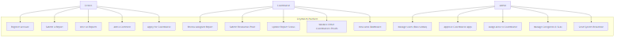
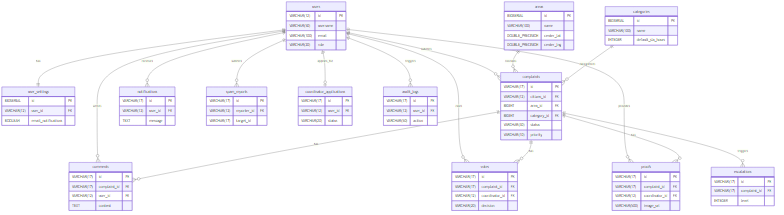
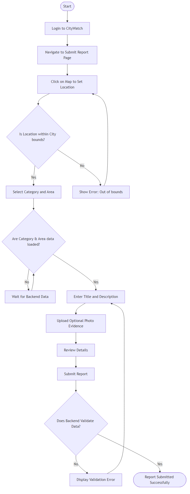
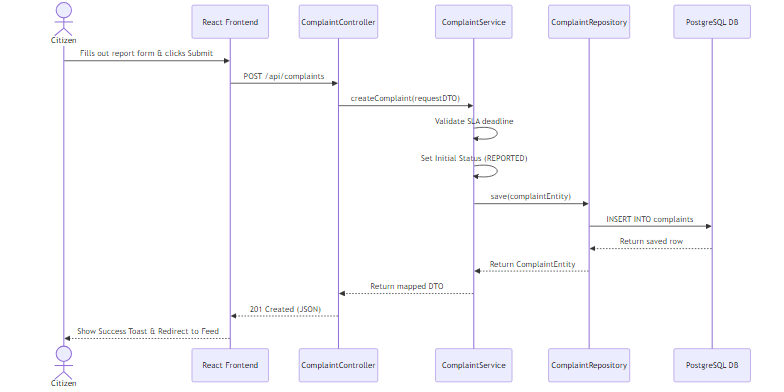
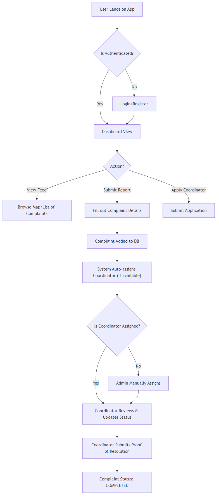
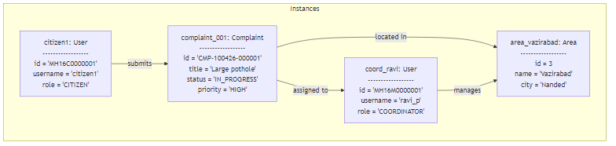
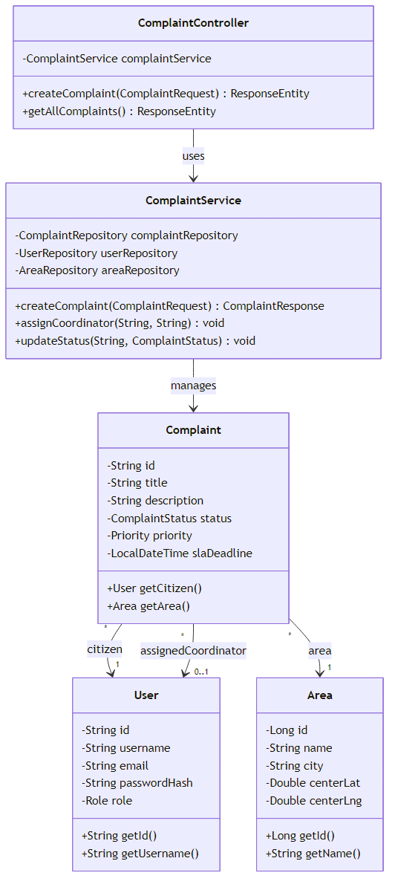

# CityWatch Technical Documentation

## 1. Use Case Diagram

## 2. Entity Relationship Diagram (ERD)

## 3. Activity Diagram (Submitting a Report)

## 4. Sequence Diagram (Submit Complaint Flow)

## 5. System Logic Flowchart

## 6. Object Diagram

## 7. Class Diagram

